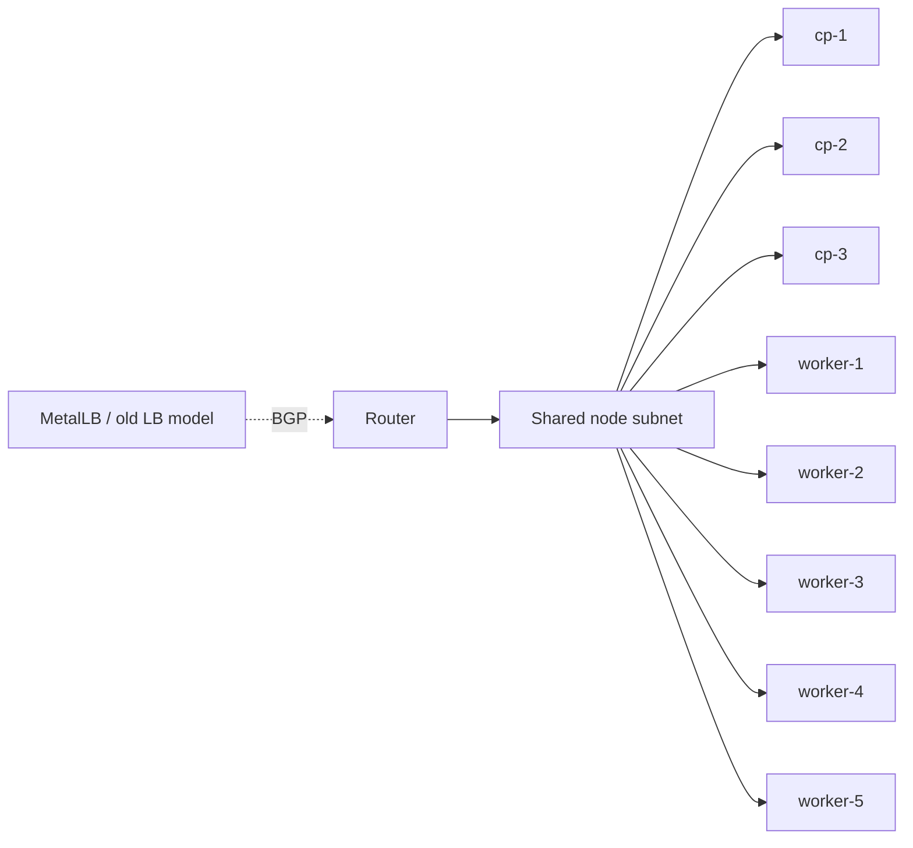
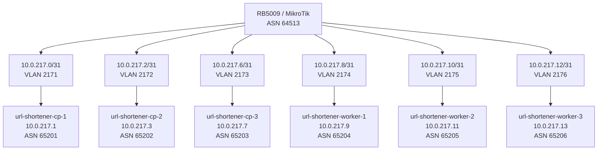

I finally hit the point where my cluster network stopped being "simple" and started being vague.

For a while, my Kubernetes nodes all lived on one shared subnet. It worked, but only in the way a lot of homelab networking works: mostly because the environment is small enough that the edges stay blurry. Once I started moving both testing and production toward Cilium with BGP, that blur became the problem.

This is the first post in a short series:

- [Part 2: Replacing Flannel and MetalLB with Cilium BGP](/blog/cilium-bgp-part-2)
- [Part 3: Migrating the Main Cluster Without Rebuilding It](/blog/main-cluster-migration-part-3)

### The old shape

The flat model was fine when the cluster was mostly "nodes on a VLAN plus some Kubernetes magic on top". But it aged badly once I wanted stricter routing and cleaner failure domains.

The problems were not dramatic. They were worse than that: subtle.

- Too much depended on shared-subnet behavior instead of explicit next hops
- Testing and production were conceptually too close to each other
- BGP topology was not as deterministic as I wanted
- Removing or replacing nodes still felt tied to one broad network segment instead of a node-specific contract

That last point mattered more than I expected. When every node is "just somewhere on the cluster VLAN", the network story sounds simple, but it also hides a lot of assumptions.

### What I wanted instead

I wanted the network model to describe reality directly:

- one node
- one VLAN
- one routed link
- one BGP peer
- one ASN

That pushed me toward per-node `/31` links.

If you're not deep into this stuff, `/31` can look a bit cursed at first. But for point-to-point links it makes a lot of sense. I don't need spare host addresses on these networks. I need exactly two usable endpoints: router side and node side.

That gives me a few nice properties:

- node addressing becomes compact and intentional
- the gateway for a node is always unambiguous
- each BGP session maps directly to one physical/logical path
- VLAN and ASN planning becomes explicit instead of incidental

### Production and testing needed to diverge on purpose

One thing I wanted to avoid was clever reuse.

Homelab infrastructure has a way of drifting toward "it's fine, I'll remember that later". Then six months later you can't remember whether a value is reused because it was designed that way or because you were lazy on a Sunday evening ;)

So I split the environments cleanly:

- Testing VLANs: `2161-2166`
- Testing ASNs: `65101-65106`
- Testing API VIP: `10.0.216.5`

- Production VLANs: `2171-2176`
- Production ASNs: `65201-65206`
- Production API VIP: `10.0.217.5`

That separation is boring, which is exactly what I want from infrastructure identifiers.

### This also forced me to simplify the cluster itself

I used the migration window to shrink production from five workers to three.

That was not just about saving resources. It was about not building routing and BGP config for nodes I no longer needed. Per-node design makes waste obvious. If each worker means another VLAN, another gateway, another peer, and another ASN, you stop keeping extra nodes around "just because".

That kind of pressure is healthy.

### What changed operationally

The shift to `/31` links changed the way I think about the cluster network:

- node networking is now infrastructure, not background scenery
- routing problems are easier to localize because every node has its own edge
- the router config is more verbose, but also more honest

The tradeoff is obvious: this is more configuration than dumping everything onto one subnet. But the configuration now matches the design instead of hand-waving past it.

That was the whole point.

In [Part 2](/blog/cilium-bgp-part-2), I'll cover the software side of the change: replacing Flannel and MetalLB with Cilium, using BGP directly from the nodes, and why kubePrism ended up mattering more than I expected.

