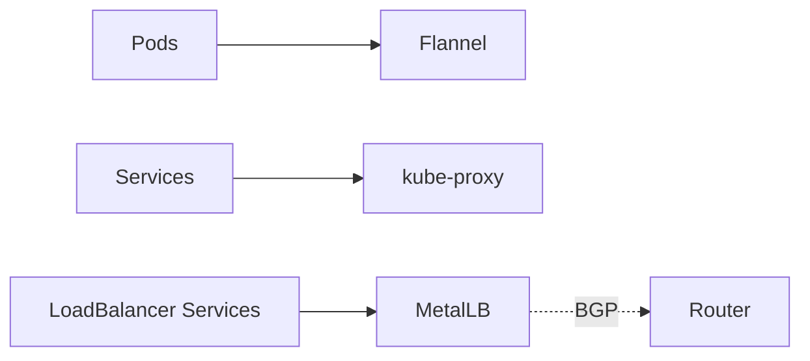
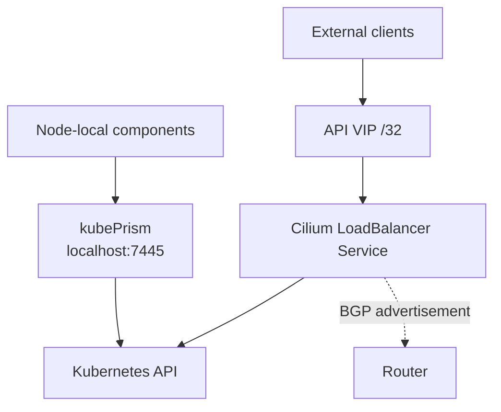

Once I decided the node network should be explicit, the old software stack started to look equally fragmented.

I had:

- Flannel for pod networking
- kube-proxy for Service routing
- MetalLB for `LoadBalancer` IPs and BGP

None of those tools are bad. But together they made the cluster feel layered in a way that no longer matched what I wanted from the network.

This is Part 2 of the series:

- [Part 1: Why I Moved My Homelab Kubernetes Nodes to /31 Links](/blog/31-links-part-1)
- [Part 3: Migrating the Main Cluster Without Rebuilding It](/blog/main-cluster-migration-part-3)

### The old stack

This worked, but it split responsibilities across too many moving parts.

Once I was already doing per-node routed links and node-specific BGP peers, Cilium became the obvious next step. It could collapse those layers into one networking stack:

- CNI
- kube-proxy replacement
- BGP control plane
- load balancer IP management

### The new stack

The nice part here is not just fewer components. It's that the components now line up with the network model.

Nodes speak BGP directly to the router.
Nodes advertise pod CIDRs.
Service VIPs are handled by the same system instead of being bolted on separately.

That is a much cleaner mental model than "Flannel does one thing, MetalLB does another thing, kube-proxy does another thing, and somehow the packets work out".

### Native routing meant I had to stop pretending the nodes were on one big LAN

This is where the `/31` design and the Cilium design met.

I run Cilium in native routing mode, not overlay mode. That means I want actual routed paths, not tunnels hiding under the floorboards.

On the production side, the key choice was to disable `autoDirectNodeRoutes`.

That flag makes sense when your nodes really do share direct L2 reachability. But once every node sits behind its own routed `/31` link, the "just install direct routes between nodes" assumption is wrong. I want the router to be the router.

So the design became:

- per-node routed links
- Cilium native routing
- BGP from each node to MikroTik
- router as the real L3 core

### The API endpoint needed its own redesign

This was the part that changed more than I expected.

Under the old world, an API VIP owned directly by Talos made sense. Under the new world, it was awkward.

I needed two different access paths:

- a node-local path that still works during bootstrap and recovery
- an external path that behaves like the rest of the routed service layer

That pushed me toward kubePrism plus a Cilium-managed API VIP.

This split ended up being one of the best parts of the migration.

Node-local components like Cilium itself talk to `localhost:7445` through kubePrism. They do not need to wait for the externally advertised VIP to exist.

At the same time, external clients still get a stable API endpoint exposed as a normal routed service VIP.

For me, that was the key architectural unlock:

- bootstrap and recovery stay local
- external access stays routed and declarative

### What the router actually learns now

With Cilium BGP in place, the router can learn two kinds of information from the cluster:

- per-node pod CIDRs
- service VIPs

That makes the Kubernetes network look much more like a real routed system and much less like a sealed box that only exposes a couple of NATed edges.

I especially like that the API VIP is no longer a weird special case. It's just another advertised service IP with a more important job.

### The price of the cleaner model

This stack is cleaner, but it is less forgiving.

When Flannel, MetalLB, and the old Talos VIP model are all gone, configuration drift becomes more visible:

- wrong peer addresses matter immediately
- stale BGP resources can conflict with each other
- the API VIP path and the node-local kubePrism path must both be correct

In other words, the design got better, but it also got stricter.

I consider that a win. Loose infrastructure feels easy right up until you have to recover it.

In [Part 3](/blog/main-cluster-migration-part-3), I'll cover the production cutover itself, including the parts that went wrong, why `force-new-cluster` ended up involved, and what I would do differently next time.

