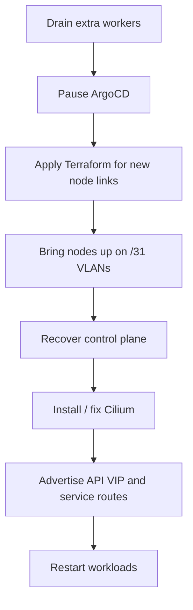

The theory was clean.

Testing already validated the routed `/31` design. Cilium was working. BGP looked good. The plan was simple enough: shrink production to three workers, move the nodes onto per-node `/31` links, bring up the new Cilium BGP config, and retire the last bits of the old network model.

Then production reminded me that migrations are never just architecture diagrams with better posture.

This is Part 3 of the series:

- [Part 1: Why I Moved My Homelab Kubernetes Nodes to /31 Links](/blog/31-links-part-1)
- [Part 2: Replacing Flannel and MetalLB with Cilium BGP](/blog/cilium-bgp-part-2)

### The cutover plan

At a high level, the migration looked like this:

This was not a rebuild. I wanted the cluster to survive the move as itself, not as a freshly provisioned replacement with the same name.

That made the migration more interesting, because the state already existed everywhere:

- Talos machine config
- etcd membership
- ArgoCD expectations
- old CNI remnants
- old BGP assumptions

### The first failure was below Kubernetes

The first thing that bit me was not Kubernetes at all. The VMs were updated in Proxmox, but they had not actually rebooted onto the new networking config.

So from the outside, the router side of the `/31` links looked alive, but the node IPs themselves did not answer. That is a very specific kind of unsettling because it feels like "maybe the control plane is dead", when the real answer is "the VMs never fully moved".

The fix was boring but necessary: stop and start the surviving control-plane and worker VMs cleanly so they actually came up on the new tagged links.

That is one of those migration lessons that sounds obvious in hindsight. It still cost time.

### Then etcd reminded me that old peer URLs are real state

Once the nodes were alive on their new addresses, the control plane still didn't come back.

The real problem was etcd peer membership. It was still trying to talk to the old peer URLs from the pre-migration addresses. At that point, "the nodes booted" and "the control plane recovered" were two very different things.

Conceptually, it looked like this:

I recovered that by using `force-new-cluster` on one control-plane node, letting it come back as the surviving authority, and then rejoining the other control-plane nodes cleanly.

This is the kind of step that looks terrifying when you read it in isolation. In context, it was the right move because the cluster was not suffering from data ambiguity. It was suffering from membership reality lagging behind network reality.

That distinction matters.

### The network was up before Cilium was truly correct

Even after the control plane was back, Cilium still needed cleanup.

Some of the live configuration still reflected the old world:

- old API host assumptions
- stale `autoDirectNodeRoutes` behavior
- leftover BGP resources that no longer matched the per-node model

This was the annoying middle phase of the migration. The cluster was not dead, but it also was not yet aligned.

That is the most fragile part of any migration: when systems are healthy enough to mislead you.

I had to line up all of the following at the same time:

- kubePrism on `localhost:7445` for node-local API access
- Cilium in native routing mode
- per-node BGP resources with unique ASNs
- a Cilium-managed API VIP service
- removal of stale networking remnants

Once those finally snapped into alignment, the network story became clean again.

### The API VIP was the psychological checkpoint

The cluster did not feel "done" when the nodes were reachable.
It felt done when the API VIP came back as a Cilium-managed `/32` and the router saw it as a real advertised service route.

That was the point where the new design stopped being a plan and became the system of record.

From there, the rest was cleanup:

- remove old worker nodes
- restart workloads
- let the cluster resettle on the new pod network
- update GitOps so production state in git matched production state in reality

### What I would do differently next time

Three things stand out.

First, I would treat etcd peer URL migration as a first-class step, not a recovery branch. If node addresses change on a control plane, that state needs explicit attention.

Second, I would be even stricter about eliminating overlapping live and target config. Old wildcard BGP resources and old API endpoint assumptions are exactly the kind of leftovers that turn migrations into archaeology.

Third, I would still make this same architectural move again.

Even with the rough edges, the end state is much better:

- production and testing are intentionally separated
- node routing is explicit
- service advertisement is unified under Cilium
- the API access model is cleaner
- the cluster now looks like infrastructure I actually designed, not just infrastructure that accumulated

That is worth a painful maintenance window.

And, honestly, this is the part of homelabbing I enjoy the most: not just making things work, but making them make sense.

