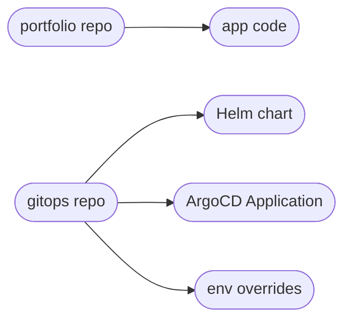
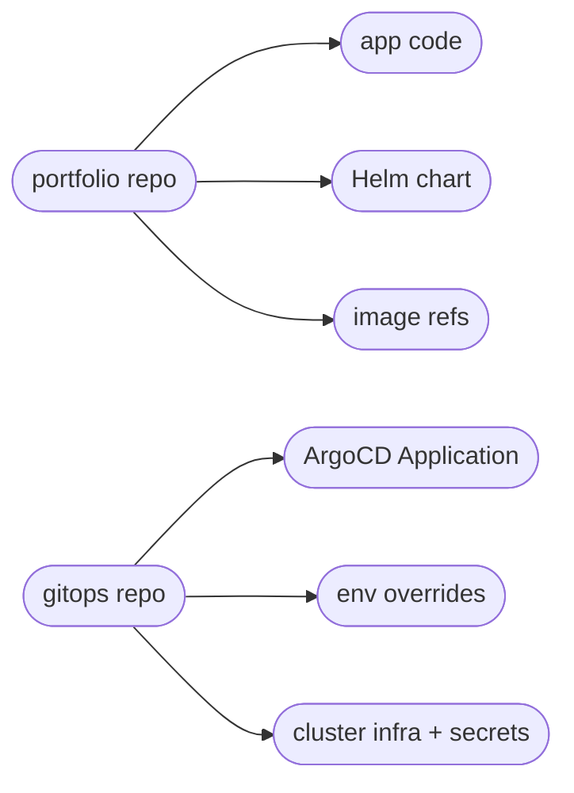

A month ago, moving my deployment flow to [ArgoCD Image Updater](/blog/pull-not-push) made a lot of sense.

At the time, the Portfolio app was still small enough that keeping the Helm chart in the `gitops` repo felt pretty reasonable. The app lived in one repo, the cluster orchestration lived in another repo, and ArgoCD glued the whole thing together just fine.

But the moment I started thinking seriously about the backend roadmap, that boundary started feeling... off.

The current Go API did its job: it got me off build-time content loading and gave the site a real backend. But I’m planning a `.NET` migration for the backend, and I also want to split parts of the app into separate services over time.

That changes the cost model quite a bit :|

### The old split

Before this change, the ownership line looked like this:

That is fine when the deployable shape is stable.

One frontend, one backend, one ingress, a couple of images. No real friction.

But once the application starts growing new service boundaries, that split gets noisy very quickly.

### Why growth changed the boundary

If I add another app-owned service under the old model, I have to change two repos every time:

- add code, image build logic, and application wiring in `portfolio`
- add or reshape Deployments, Services, and Helm values in `gitops`

That’s not a GitOps benefit. That’s just operational overhead.

The annoying part is that these are often application-scoped changes. If I introduce a new internal API, worker, or microservice, the deployable topology of the app changes together with the code. Splitting those reviews across two repos means more coordination, more chances to forget a piece, and less obvious ownership.

I want the deployable shape of the app to live next to the app code.

### The new split

So I moved the Portfolio Helm chart into the `portfolio` repo.

The new ownership line looks like this:

That gives me a cleaner boundary:

- `portfolio` owns the app chart, image references, and app-owned service topology
- `gitops` owns ArgoCD Applications, environment-specific overrides, secrets, and shared platform infrastructure

This is still GitOps. I didn’t move cluster orchestration into the app repo. I just stopped using the GitOps repo as the place where the application release definition itself had to live.

### Why this fits the roadmap better

The main driver here is the planned `.NET` backend migration and the fact that I want room for microservices without turning every service addition into a two-repo coordination exercise.

If the app grows from:

- frontend
- backend

into something more like:

- frontend
- gateway or API service
- content service
- background worker
- whatever comes next

then keeping the chart in `gitops` becomes harder to justify. The more app-owned services I add, the more unnatural that split gets.

Now the application repo owns the deployable artifact, which is exactly where I want that complexity to live.

### What stays in GitOps

The `gitops` repo still matters a lot.

It still owns:

- ArgoCD Applications
- production vs testing overrides
- ingress hosts and TLS settings
- shared infra like Longhorn, monitoring, ingress-nginx, and secrets

That repo is still the cluster control plane. It just no longer needs to pretend it is also the best home for my application topology :)

### Final result

The practical outcome is simple:

- app code, chart structure, and image versioning move together
- environment policy stays in GitOps
- adding future services gets cheaper

The earlier setup wasn’t wrong. It fit the app I had.

This setup fits the app I’m building next.

