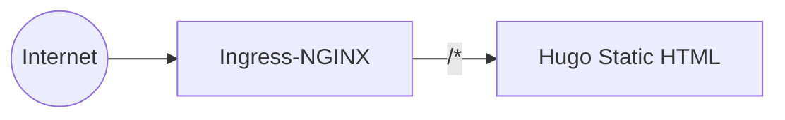
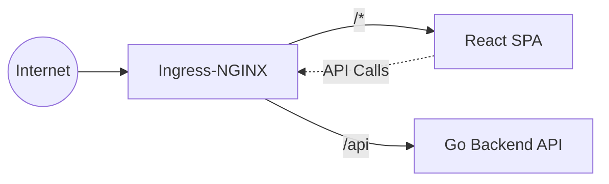

I've been holding onto a static site generator (Hugo) for a while now. Static sites are great, fast, and simple. Until you decide you want to build things that actually require a backend! 

### The Breaking Point

The main driver for this refactor was a growing to-do list of features that were outright impossible with just static HTML

- Tracking view counts for posts
- Displaying live cluster stats and CI/CD statuses
- Loading posts from an S3 bucket or a database, rather than baking markdown files directly into the code

So, I needed an API.

### The Backend

I went with Go and the Gin framework. They're super lightweight, and since I had already used Gin in a previous URL shortener project, it felt familiar. 

### How it worked before

### How it works now

Keeping this high-level (no code this time), the architecture is dead simple: a small binary that serves up the posts as JSON via a couple of REST endpoints. 

Honestly, the backend part of this migration went incredibly smoothly. It just worked. The real headaches started when I had to get the React frontend to play nicely — specifically with CSS. D:

### The Frontend (and CSS Headaches)

With the Go API humming along, I spun up a standard React + Vite setup. Getting the markdown to fetch and render from the API was a breeze. The real battle was the styling. 

Coming from a static generator, a good chunk of my old styles worked nicely out of the box. But a significant part of them didn't translate seamlessly into a modular React environment. Things just operate differently under the hood. I spent a fair amount of time adjusting and rewriting CSS so the whole application didn't look broken. :/

### Smooth Transitions

While I was knee-deep fixing CSS quirks, I decided to overhaul the feel of the page. I introduced some animated, smooth transitions between routes. 

Not only does this give a fast, premium feel, but it had an awesome side-effect: it masked the loading of the Mermaid diagrams!

Instead of those complex diagrams awkwardly "popping" into place on the screen as you scroll, they now slide gracefully into view fully loaded. Getting these diagrams to work accurately (and matching the dark/light themes) definitely accounted for the bulk of my time spent on the frontend. 

It was a tough refactor, but seeing the end result — a lightning-fast, highly modular SPA without harsh reloads — made the headaches totally worth it. :)

### Next up

In [Part 2](/blog/spa-migration-part-2), we'll talk about deploying this setup and pushing it into the Kubernetes cluster.

