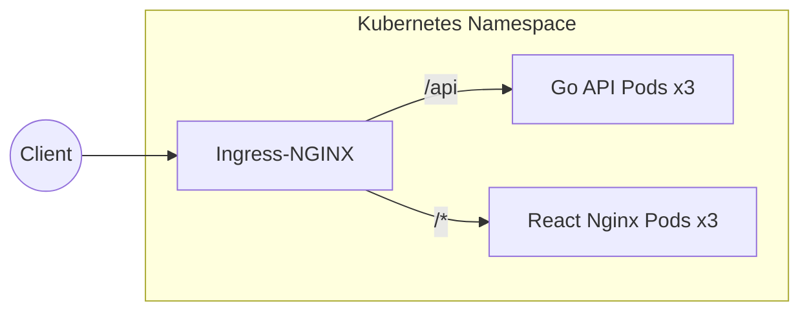
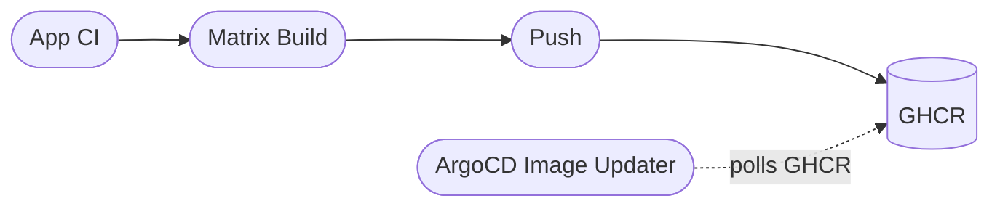

With the backend serving API data and the frontend securely wrangling the CSS, it was time to actually get this thing running on the homelab.

Moving from a static Hugo site to a split React/Go architecture (which I covered in [Part 1](/blog/spa-migration-part-1)) meant the deployment process had to get a little more sophisticated.

### Containerizing the Split

Since we split into a backend and frontend, we now need two separate container images:

- **Backend:** A tiny scratch container holding just the compiled Go binary. Thanks to `go:embed`, the markdown content is baked right in. No external mounts needed.
- **Frontend:** A multi-stage build that compiles the React app with Vite, and then uses an Nginx container to serve the static files.

### The Helm Chart

I updated the core Portfolio Helm chart to spin up deployments for both components. 

The Ingress routes all `/api` traffic directly to the Go backend service, while everything else falls through to the frontend. The frontend Nginx is specifically configured to serve `index.html` for any 404s, letting the React Router handle the client-side navigation. 

Running 3 replicas of each means zero-downtime rollouts when new blog posts are deployed. :)

### CI/CD and ArgoCD

Because the new architecture requires building two distinct images, I updated the `.github/workflows/ci.yml` pipeline to use a build matrix. On every push to `main`, GitHub Actions automatically builds and pushes both the `frontend` and `backend` images to GHCR.

Just like I covered in my previous ["Pull, Not Push"](/blog/pull-not-push) post, the CI pipeline's only job is to push to the registry. The ArgoCD Image Updater spots the new SHA tags in GHCR, patches the `.argocd-source-portfolio.yaml` file in the GitOps repo, and ArgoCD seamlessly rolls out the new pods. 

No messy `yq` scripts, no push-based CI races. It just works. ;)

### Was it worth it?

It's definitely more moving parts than the old static Hugo setup. I went from dropping a `.md` file into a folder to managing split containers, APIs, and React routers. 

But for the sake of expandability — and finally being able to add dynamic features like view counts or live cluster stats — it was totally worth the weekend grind. 

