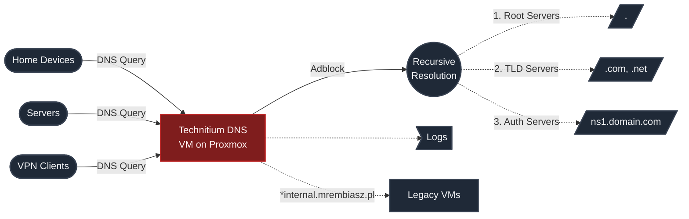
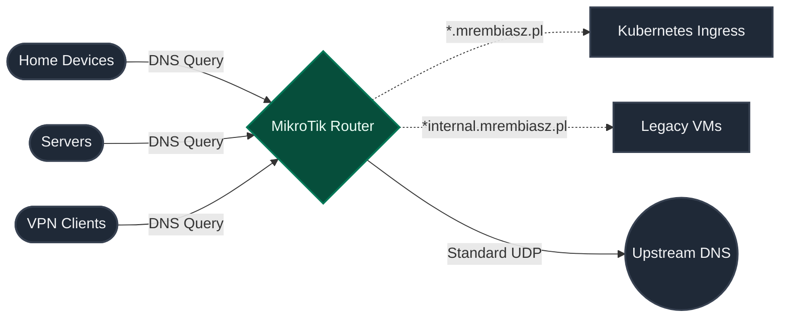

I've finally decided to migrate my old, hand-configured Proxmox VMs to a declarative Kubernetes setup. But before tearing down the compute nodes, I needed to make sure doing so wouldn't take down the entire house's internet.

Step one: Move DNS off a Proxmox VM. I ripped out my Technitium DNS server and moved everything to my MikroTik router.

Technitium was honestly fine for a while. It was the backbone of my old infra (pre-cluster days, which I talked in [about](../../about)), but it was a single point of failure that was starting to show its age in my workflow. 

### Why I left Technitium



First off, the UI. Setting custom DNS entries was just... tedious. Clicking through zones, adding records manually in a web GUI — it gets old fast. I also realized I was checking the query logs extremely sparsely, so having a dedicated dashboard for it was overkill.

More importantly, it was causing actual headaches:
- **Weird blocklist/recursive issues:** I had slow cold lookups, and some services (like Netflix) would just straight up stop working randomly. 
- **The big one:** Any time I restarted Proxmox or did some heavy lab work, DNS would break. And when DNS breaks, internet connectivity breaks. It was incredibly annoying to have to drop to mobile data just to fix my lab, not to mention the family losing their streaming services while I tinkered :|

So, I decided to simplify. Instead of running a local adblocker, I just pointed the MikroTik router upstream to Control D and Quad9 (which handle ads and tracking natively) and let it handle the rest.

### The Migration



Moving to MikroTik DNS was surprisingly smooth. I set it up using upstream providers and it just worked. 

Well, mostly.

I couldn't get DNS-over-HTTPS (DoH) to work. Most modern resolvers use HTTP/2, which my MikroTik doesn't support yet, so it only wants older HTTPS. I ended up just sticking to standard DNS over UDP. Honestly? It's fine for me. If I really need privacy on a specific device, I'll just tunnel through a VPN.

Migrating my custom DNS entries was super straightforward. I used a simple regex in MikroTik's Static DNS table to point `*.mrembiasz.pl` directly to my Kubernetes ingress, and another for my legacy VMs:

```text
# Kubernetes Ingress
Regexp: ^(.+\.)?mrembiasz\.pl$
Address: 10.0.216.1

# Legacy VMs
Regexp: .*\.internal\.mrembiasz\.pl
Address: 10.0.40.53
```

This had an awesome side effect: it enabled my services to see the real local IP of incoming queries. Because of that, I was able to implement strict access controls — restricting my admin panels to local IPs and VPN access only, all while keeping my `mrembiasz.pl` domain and certs intact. Massive win!

As for getting my devices onto the new DNS, I updated my DHCP server to hand out the MikroTik's IP to clients. I'm still slowly migrating a few servers with static IPs over to the new resolver, but the bulk of the network moved over instantly ;)

### The Verdict

The new setup is working great. It's one less service I have to actively manage and babysit when I'm tearing down my lab. 

Some might look at moving from a dedicated DNS server like Technitium to a router's built-in DNS as a downgrade, but for my workflow and sanity? It's definitely an upgrade. :)

With DNS now running safely on the router, I can actually start dismantling the old VMs and migrating services to the cluster. I'll cover the rest of that in the next post.


