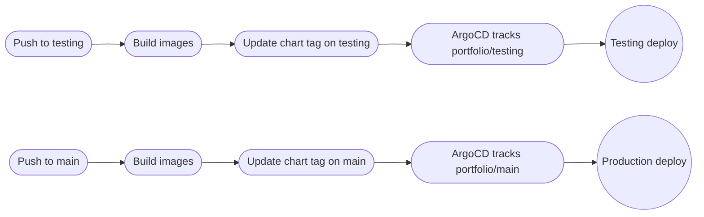

Once I moved the Helm chart into the app repo, the next question showed up immediately:

how do I actually promote releases without coupling testing and production together?

Luckily, I already had most of the answer.

My `gitops` setup already had a separate `testing` branch and a separate testing cluster. I originally used it to validate infra changes, networking changes, and Helm/chart changes in a prod-like environment before touching production.

So instead of inventing some new preview-environment workflow for the app, I just reused the thing I already had. Which is honestly my favorite kind of architecture change ;)

### Why the testing cluster was the right fit

This wasn’t a fake staging namespace on the same cluster. It was already a separate environment with its own branch, domains, networking config, and ArgoCD app-of-apps flow.

That made it a very natural place to validate application changes too.

For the Portfolio app, the environment difference is small enough that Helm handles it cleanly:

- the base chart lives in the `portfolio` repo
- `gitops` keeps the environment-specific ArgoCD Application settings
- testing just patches the base Application with a different branch and different override values

In practice, that means the environment split is cheap. It is basically one extra override file, not a whole second deployment system.

### The release flow now

The release model is branch-coupled:

- `testing` branch drives the testing deployment
- `main` branch drives the production deployment

The flow looks like this:

The key point is that the chart update happens on the same branch that built the images.

So if I push to `testing`:

- CI builds the images
- CI updates the Helm chart tag on `testing`
- ArgoCD sees a new revision on `testing`
- the testing cluster rolls out that exact app/chart combination

And `main` works the same way for production.

### Why I like this better

This gives me a real pre-production lane without muddying production state.

I can test:

- app changes
- deployment changes
- chart structure changes

in an environment that already exists for this exact kind of validation.

I also like that it keeps the version story tight:

- the code lives on a branch
- the chart lives on the same branch
- the chart points at images built from that branch
- ArgoCD watches that same branch

That is much easier to reason about than having the app version in one place and the deployable version materialized somewhere else later. Much less "wait, what exactly is running there?" energy :D

### Why Helm made this easy

If the testing environment needed an entirely different deployment model, this would be messy.

But it doesn’t.

It mostly needs a few environment-specific differences:

- different hostname
- different branch target
- sometimes different TLS or replica settings

That fits Helm and ArgoCD very naturally. The base chart stays application-focused, while the GitOps repo adds the small amount of environment-specific policy on top.

### What this unlocks

The nice part is that this scales with the app.

As the backend grows, and especially as I move toward the planned `.NET` migration and future microservices, I now have a release model where:

- the application repo owns the deployable bundle
- the GitOps repo owns the environment policy
- the testing cluster stays a real validation lane instead of an afterthought

That’s exactly what I wanted.

The chart move solved the ownership problem.  
The branch-coupled flow solved the promotion problem.

And because the testing environment already existed, the whole thing ended up being much simpler than it sounds on paper :)

