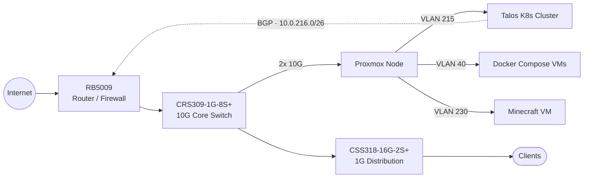

Topology

Compute

Primary Node

<table class="spec-table">
<tr><td>Platform</td><td>Supermicro X10SRL-F</td></tr>
<tr><td>CPU</td><td>Xeon E5-2680 v4 (14C/28T)</td></tr>
<tr><td>Memory</td><td>128 GB DDR4 ECC</td></tr>
<tr><td>Network</td><td>2x 10GbE SFP+</td></tr>
<tr><td>Storage</td><td>2x 1.92 TB Samsung PM863a (ZFS mirror)</td></tr>
<tr><td>Case</td><td>4U rackmount</td></tr>
<tr><td>Hypervisor</td><td>Proxmox VE</td></tr>
</table>

Power

<table class="spec-table">
<tr><td>UPS</td><td>APC Back-UPS Pro 1200VA</td></tr>
</table>

Networking

<table class="spec-table">
<tr><td>Router</td><td>MikroTik RB5009</td></tr>
<tr><td>Core switch</td><td>MikroTik CRS309-1G-8S+ (10G)</td></tr>
<tr><td>Distribution</td><td>MikroTik CSS318-16G-2S+ (1G)</td></tr>
<tr><td>Load balancing</td><td>MetalLB via BGP (ASN 64512 ↔ 64513)</td></tr>
<tr><td>IP pool</td><td>10.0.216.0/26</td></tr>
</table>

Kubernetes Cluster

Talos Linux 1.12.2 / Kubernetes 1.32.0, provisioned with Terraform, managed via ArgoCD

Control Plane (3 nodes)

<table class="spec-table">
<tr><td>CPU</td><td>2 cores per node</td></tr>
<tr><td>Memory</td><td>4 GB per node</td></tr>
<tr><td>Disk</td><td>30 GB per node</td></tr>
<tr><td>HA VIP</td><td>10.0.215.5</td></tr>
</table>

Workers (5 nodes)

<table class="spec-table">
<tr><td>CPU</td><td>4 cores per node (20 total)</td></tr>
<tr><td>Memory</td><td>8 GB per node (40 GB total)</td></tr>
<tr><td>Disk</td><td>50 GB per node (250 GB total)</td></tr>
<tr><td>VLAN</td><td>215</td></tr>
</table>

Infrastructure

<table class="spec-table">
<tr><td>ArgoCD</td><td>GitOps continuous delivery</td></tr>
<tr><td>Ingress-NGINX</td><td>Ingress controller (DaemonSet)</td></tr>
<tr><td>Cert-Manager</td><td>Let's Encrypt TLS automation</td></tr>
<tr><td>MetalLB</td><td>Bare-metal load balancer (BGP mode)</td></tr>
<tr><td>Longhorn</td><td>Distributed block storage (3 replicas)</td></tr>
</table>

Workloads

<table class="spec-table">
<tr><td>Portfolio</td><td>This site (3 replicas)</td></tr>
</table>

Docker Compose VMs

Running on Debian VMs, migrating to Kubernetes

<table class="spec-table">
<tr><td>Technitium</td><td>DNS server</td></tr>
<tr><td>Vaultwarden</td><td>Password manager</td></tr>
<tr><td>Uptime Kuma</td><td>Service monitoring</td></tr>
<tr><td>ddclient</td><td>Dynamic DNS updates</td></tr>
<tr><td>Caddy</td><td>Internal reverse proxy</td></tr>
</table>

Other VMs

<table class="spec-table">
<tr><td>Minecraft</td><td>Modded server</td></tr>
</table>

Next up

<ul class="plan-list">
<li>Add a comprehensive monitoring stack to the cluster (Prometheus, Grafana, Loki)</li>
<li>Migrate Docker Compose services to Kubernetes</li>
</ul>
