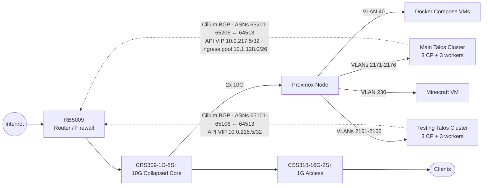

Last updated: April 9, 2026

Topology

Compute

Primary Node

<table class="spec-table">
<tr><td>Platform</td><td>Supermicro X10SRL-F</td></tr>
<tr><td>CPU</td><td>Xeon E5-2640 v4 (10C/20T)</td></tr>
<tr><td>Memory</td><td>128 GB DDR4 ECC</td></tr>
<tr><td>Network</td><td>2x 10GbE SFP+</td></tr>
<tr><td>Storage</td><td>2x 1.92 TB Samsung PM863a (ZFS mirror)</td></tr>
<tr><td>Case</td><td>2U rackmount</td></tr>
<tr><td>Hypervisor</td><td>Proxmox VE</td></tr>
</table>

Power

<table class="spec-table">
<tr><td>UPS</td><td>APC Back-UPS Pro 1200VA</td></tr>
</table>

Networking

<table class="spec-table">
<tr><td>Router</td><td>MikroTik RB5009</td></tr>
<tr><td>DNS</td><td>MikroTik Router (Control D & Quad9)</td></tr>
<tr><td>Collapsed core switch</td><td>MikroTik CRS309-1G-8S+ (10G)</td></tr>
<tr><td>Access switch</td><td>MikroTik CSS318-16G-2S+ (1G)</td></tr>
<tr><td>Node networking</td><td>Per-node routed `/31` links with dedicated VLANs and eBGP sessions</td></tr>
<tr><td>Cluster routing</td><td>Cilium BGP control plane to MikroTik (router ASN 64513)</td></tr>
<tr><td>Production VLANs</td><td>2171-2176</td></tr>
<tr><td>Testing VLANs</td><td>2161-2166</td></tr>
<tr><td>Production API VIP</td><td>10.0.217.5/32</td></tr>
<tr><td>Testing API VIP</td><td>10.0.216.5/32</td></tr>
<tr><td>Production ingress pool</td><td>10.1.128.0/26</td></tr>
</table>

Kubernetes Clusters

Talos Linux 1.12.2 / Kubernetes 1.32.0, provisioned with Terraform, managed via ArgoCD

Main Cluster

<table class="spec-table">
<tr><td>Role split</td><td>3 control planes + 3 workers</td></tr>
<tr><td>Control plane</td><td>4 vCPU, 6 GB RAM, 30 GB disk per node</td></tr>
<tr><td>Workers</td><td>4 vCPU, 8 GB RAM, 50 GB disk per node</td></tr>
<tr><td>API access</td><td>kubePrism locally, VIP `10.0.217.5` externally</td></tr>
<tr><td>Routing</td><td>VLANs 2171-2176, `/31` node links, ASNs 65201-65206</td></tr>
<tr><td>Pod CIDR</td><td>10.245.0.0/16</td></tr>
</table>

Testing Cluster

<table class="spec-table">
<tr><td>Role split</td><td>3 control planes + 3 workers</td></tr>
<tr><td>Control plane</td><td>3 vCPU, 6 GB RAM, 20 GB disk per node</td></tr>
<tr><td>Workers</td><td>2 vCPU, 4 GB RAM, 30 GB disk per node</td></tr>
<tr><td>API access</td><td>kubePrism locally, VIP `10.0.216.5` externally</td></tr>
<tr><td>Routing</td><td>VLANs 2161-2166, `/31` node links, ASNs 65101-65106</td></tr>
</table>

Platform

<table class="spec-table">
<tr><td>ArgoCD</td><td>GitOps continuous delivery</td></tr>
<tr><td>GitHub Actions</td><td>Branch-coupled image builds and chart updates</td></tr>
<tr><td>Cilium</td><td>CNI, kube-proxy replacement, BGP control plane, VIP management</td></tr>
<tr><td>Ingress-NGINX</td><td>Ingress controller (DaemonSet)</td></tr>
<tr><td>Cert-Manager</td><td>Let's Encrypt TLS automation</td></tr>
<tr><td>Kube-Prometheus-Stack</td><td>Metrics, alerting, and dashboards</td></tr>
<tr><td>Longhorn</td><td>Distributed block storage (3 replicas)</td></tr>
<tr><td>Sealed Secrets</td><td>Git-managed secret delivery</td></tr>
</table>

Workloads

<table class="spec-table">
<tr><td>Portfolio</td><td>This site (React SPA + Go API, 3 replicas each)</td></tr>
<tr><td>Filebrowser</td><td>Internal web file access</td></tr>
</table>

Docker Compose VMs

Running on Debian VMs, migrating to Kubernetes

<table class="spec-table">
<tr><td>Vaultwarden</td><td>Password manager</td></tr>
<tr><td>Uptime Kuma</td><td>Service monitoring</td></tr>
<tr><td>ddclient</td><td>Dynamic DNS updates</td></tr>
<tr><td>Caddy</td><td>Internal reverse proxy</td></tr>
</table>

Other VMs

<table class="spec-table">
<tr><td>Minecraft</td><td>Modded server</td></tr>
</table>

Next up

<ul class="plan-list">
<li>Migrate portfolio backend to .NET and split into microservices</li>
<li>Migrate Docker Compose services to Kubernetes</li>
<li>Add centralized log aggregation alongside the existing monitoring stack</li>
<li>Add another Proxmox node to reduce the single-host failure domain</li>
</ul>
