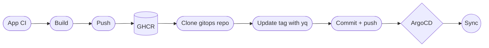
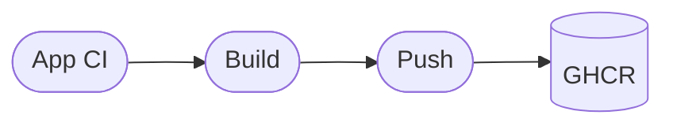
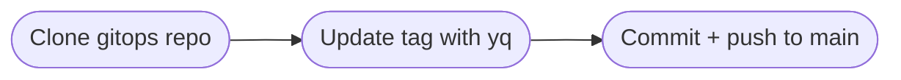
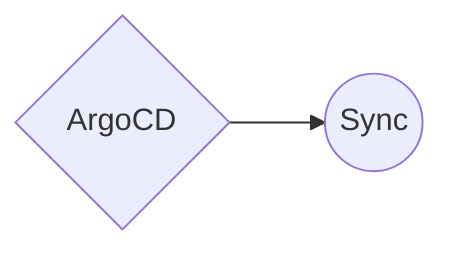
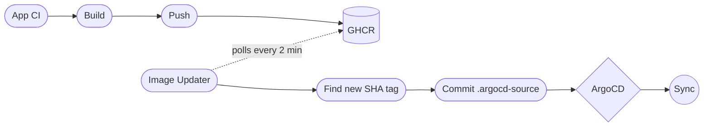

Up until today, every time my portfolio app built a new container image, the CI pipeline would clone the gitops repo, update the image tag in the ArgoCD Application manifest, and push the commit. A classic push model.

It worked fine for one app. But I started thinking about what happens when I add a second, third, fifth one. Every app repo would need:

- a PAT with write access to the gitops repo
- knowledge of the exact file path and YAML structure to update
- a `yq` command that breaks the moment I refactor anything

And if two pipelines push at the same time? `non-fast-forward`. Race conditions on `main` :/

So I switched to a pull model using [ArgoCD Image Updater](https://argocd-image-updater.readthedocs.io/).

### How it worked before

---

The app CI builds a container image tagged with the short commit SHA (`sha-abc1234`) and pushes it to GitHub Container Registry. This part is fine — it's what any CI should do.

Here's where it gets messy. The same CI job clones the entire gitops repo, runs `yq` to update the image tag inside an ArgoCD Application manifest, and pushes the change to `main`. The app repo needs a `GITOPS_TOKEN` with write access, knows the exact file path and YAML structure of the gitops repo, and breaks the moment anything gets refactored.

ArgoCD detects the new commit on `main` within 30 seconds and rolls out the new image. This part is also fine — it's what ArgoCD is built for.

### How it works now

The app repo's only job is to build and push an image. It doesn't know the gitops repo exists :)

### The app-of-apps catch

One thing I almost missed: my root Application has `selfHeal: true`. Without git write-back, the Image Updater would patch the Application CR in-cluster, and then the root app would immediately revert it because it doesn't match what's in git. They'd fight each other forever :P

Git write-back solves this. The updater commits a small override file (`.argocd-source-portfolio.yaml`) to the chart directory, so git stays the source of truth and self-heal has nothing to complain about.

### The bumps along the way

This wasn't plug-and-play. A few things bit me:

**Annotations don't work anymore.** I initially configured the Image Updater using annotations on the Application resource — that's what most guides online still show. Turns out v1.0+ moved to a CRD-based model. The controller just logged `No ImageUpdater CRs to process` and ignored everything. Had to create an `ImageUpdater` custom resource instead.

**GHCR auth is picky.** Even for public packages, GHCR requires authentication to list tags. My first attempt with a fine-grained PAT got `denied` — those don't play well with the Docker v2 registry API. Switching to a classic PAT with `read:packages` still didn't work until I changed the secret type from an opaque `secret:` reference to a `pullsecret:` (docker-registry format). That finally got the Image Updater to talk to GHCR properly.

**Git write-back needs the right permissions.** The push to the gitops repo initially failed — I thought fine-grained PATs didn't work with Git HTTP push, so I used a classic PAT with `repo` scope. Turns out I probably just had a typo when pasting the token. After retesting, fine-grained PATs work perfectly for git write-back. I've since switched `git-creds` to a fine-grained PAT scoped only to the gitops repo with `Contents: Read and write` — much better than a classic PAT's broad `repo` scope across all repositories.

Turns out fine-grained PATs [can't access Packages at all](https://docs.github.com/en/authentication/keeping-your-account-and-data-secure/managing-your-personal-access-tokens#fine-grained-personal-access-tokens-limitations) — it's a [known gap](https://github.com/orgs/community/discussions/38467) that's been open since 2022. So for anything touching GHCR, classic PATs it is. But for git operations, fine-grained PATs are the way to go.

### What it took

- One `ImageUpdater` CRD defining what to track
- A multi-source ArgoCD Application (Helm chart + CRs from git)
- Two secrets (`ghcr-creds` as docker-registry type, `git-creds` with fine-grained PAT)
- Deleting the "update image tag in gitops" step from the portfolio CI
- A custom commit message template so the auto-commits match the repo's `chore:` convention

The best part: adding the next app is just a new YAML file. No new CI wiring, no new secrets, no new PATs. ;)

